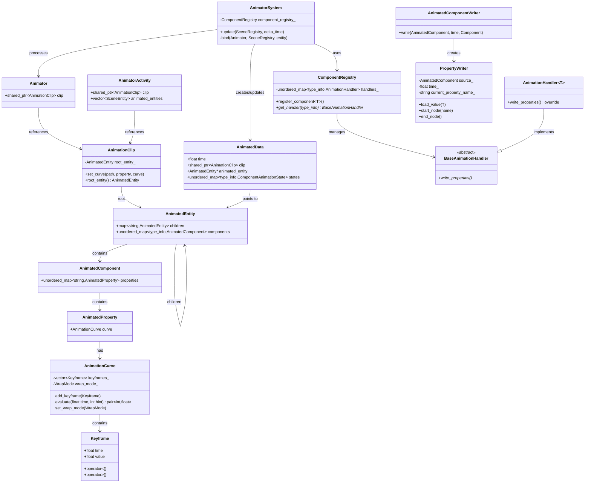

# nodec_animation Architecture Documentation

## Overview

nodec_animation is a module that provides animation functionality for ECS components in the nodec game engine. It enables property animation through animation curves and clips, with automatic property reflection and updating.

## Core Concepts

### 1. Animation Curve
- **Purpose**: Represents a time-based animation of a single float value
- **Key Features**:
  - Keyframe-based interpolation
  - Support for different wrap modes (Once, Loop)
  - Efficient evaluation with hint-based optimization

### 2. Animation Clip
- **Purpose**: Collection of animation curves for multiple properties across multiple components
- **Structure**: Hierarchical entity-component-property mapping
- **Usage**: Defines complete animations that can be applied to entity hierarchies

### 3. Component Property Animation
- **Purpose**: Automatically animate component properties using serialization reflection
- **Mechanism**: Leverages Cereal serialization to discover and update properties

## Class Diagram



## Animation Flow

### 1. Initialization Phase
```
1. AnimatorSystem detects Animator component with AnimatorStart signal
2. Creates AnimatorActivity to track animation state
3. Binds animation clip to entity hierarchy:
   - Traverses entity hierarchy matching names
   - Creates AnimatedData components for each animated entity
   - Stores references to AnimatedEntity data from clip
```

### 2. Update Phase (Per Frame)
```
1. AnimatorSystem processes all AnimatedData components
2. For each animated entity:
   a. Get registered component handlers from ComponentRegistry
   b. Use AnimatedComponentWriter to write animated properties
   c. PropertyWriter traverses component structure using Cereal
   d. Evaluates animation curves at current time
   e. Updates component property values
   f. Advances animation time by delta_time
```

### 3. Property Reflection Mechanism

The property animation system uses **Cereal serialization** for automatic property discovery and updating:

#### How It Works:
1. **Property Path Construction**: 
   - PropertyWriter acts as a Cereal InputArchive
   - As it traverses the component structure, it builds property paths (e.g., "transform.position.x")
   
2. **Value Interpolation**:
   - When reaching a leaf property (arithmetic type), looks up animation curve
   - Evaluates curve at current time to get interpolated value
   - Writes value back to component property

3. **Type Safety**:
   - Uses template specialization for different property types
   - Handles arithmetic types, strings, and smart pointers differently
   - Ignores non-animatable types (e.g., shared_ptr, unique_ptr)

#### Example Property Animation:
```cpp
// Component definition
struct Transform {
    Vector3 position;
    Quaternion rotation;
    Vector3 scale;
    
    template<class Archive>
    void serialize(Archive& ar) {
        ar(CEREAL_NVP(position),
           CEREAL_NVP(rotation), 
           CEREAL_NVP(scale));
    }
};

// Animation clip setup
clip->set_curve<Transform>("", "position.x", curve_x);
clip->set_curve<Transform>("", "position.y", curve_y);
clip->set_curve<Transform>("child_entity", "scale.x", scale_curve);
```

## Component Registration

Components must be registered with the ComponentRegistry to be animatable:

```cpp
ComponentRegistry registry;
registry.register_component<Transform>();
registry.register_component<SpriteRenderer>();
// ... register other animatable components
```

## Animation State Management

### Per-Entity State
- **AnimatedData**: Stores animation time and curve evaluation hints per entity
- **ComponentAnimationState**: Tracks current keyframe indices for optimization

### Per-Animation State
- **AnimatorActivity**: Links animator to all affected entities
- Handles animation rebinding when clips change
- Manages cleanup when animation stops

## Performance Optimizations

1. **Hint-based Curve Evaluation**: 
   - Stores last keyframe index to avoid binary search
   - Reduces O(log n) to O(1) for sequential evaluation

2. **Lazy Binding**:
   - Only creates AnimatedData for entities that exist in hierarchy
   - Skips entities without matching names

3. **Component Caching**:
   - Reuses AnimatorActivity when same clip is restarted
   - Only rebinds when clip changes

## Usage Example

```cpp
// 1. Create animation clip
auto clip = std::make_shared<AnimationClip>();

// 2. Add animation curves for properties
AnimationCurve position_x_curve;
position_x_curve.add_keyframe({0.0f, 0.0f});
position_x_curve.add_keyframe({1.0f, 100.0f});
clip->set_curve<Transform>("", "position.x", position_x_curve);

// 3. Register component types
ComponentRegistry registry;
registry.register_component<Transform>();

// 4. Attach animator to entity
auto animator = registry.emplace_component<Animator>(entity);
animator.clip = clip;

// 5. Start animation
registry.emplace_component<AnimatorStart>(entity);

// 6. Update system each frame
AnimatorSystem system(registry);
system.update(scene_registry, delta_time);
```

## Key Design Decisions

1. **Serialization-based Reflection**: Uses existing Cereal serialization for property discovery, avoiding separate reflection system

2. **Hierarchical Animation**: Supports animating child entities through path-based addressing

3. **Component-agnostic**: Any serializable component can be animated without modification

4. **ECS Integration**: Fully integrated with the ECS pattern, using components for animation state

5. **Type Safety**: Template-based system ensures type safety at compile time